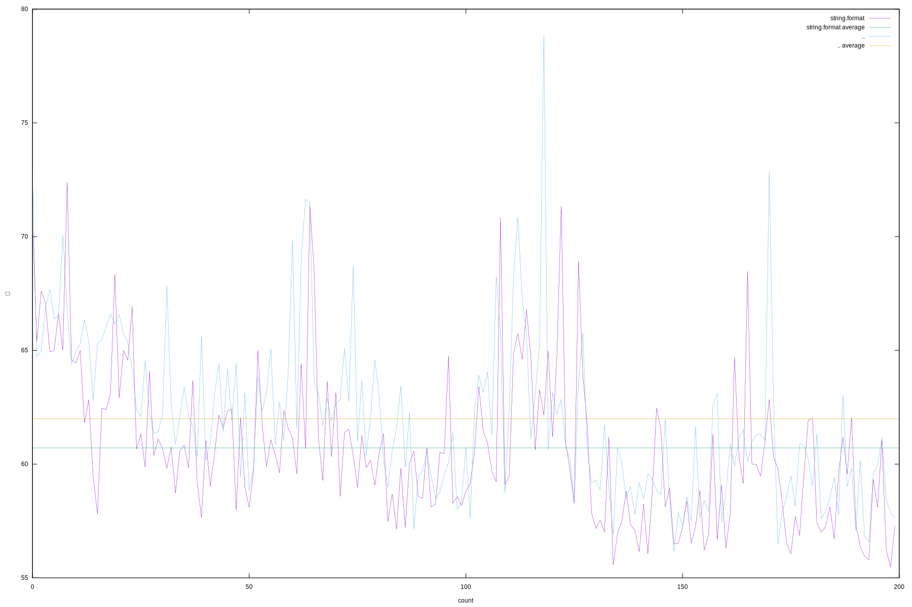

# luajitで文字列連結処理のベンチ

`..`による文字列連結と、string.format()による文字列連結のどちらが速いかを調べる目的で書いた。  
単純に文字を追加していく。  
正当性は不明。  

GCの影響があるのでGCの使い方を変えながら比較した。  
文字列が長くなると、文字列連結処理自体が大変時間がかかるので、ある程度長くなったらリセットしている。  
連結する文字列の長さで性能に違いがあるかもしれないが、そこまでは比較していない。  

## 結論


string.formatが 2~3% くらい速いかもしれない。
大きな性能差はない結果になった。  
コーディング中に書きやすい方を使用すべき、という結論とする。  

考察としては、
* GCによってぶれが大きくなるように見える。
* 強いて言えば、'..'がGCに時間がかかっているように見える。  
実装を見ているわけではないので、これも気のせいかもしれない。  

* 実行するたびに数%ぶれるので、このぶれが統計的に有意なのか計算するべきだと思われるが、  
現状面倒で、というか数%くらいの有意性ならコーディング中に書きやすい方を使用すべきだと思われるので、  
そこまではやっていない。

下記は何度か実行した際の出力。出力のキーの順序がランダムな出力になるのでソートしている。
```
{
	["auto gc : OFF, manual gc : OFF"]	 = +5.13%, +2.83%, +0.19%, +0.89%,
	["auto gc : OFF, manual gc : ON"]	 = +4.17%, -1.40%, +2.92%, +3.08%,
	["auto gc : ON, manual gc : OFF"]	 = +0.34%, -0.22%, -0.73%, +7.53%,
	["auto gc : ON, manual gc : ON"]	 = -4.47%, +5.50%, -0.49%, +4.32%,
}
{
	["auto gc : OFF, manual gc : OFF"]	 = +1.89%, +3.89%, +2.44%, +2.07%,
	["auto gc : OFF, manual gc : ON"]	 = +2.76%, +1.03%, +3.69%, -3.08%,
	["auto gc : ON, manual gc : OFF"]	 = +1.95%, +4.53%, -0.77%, -1.04%,
	["auto gc : ON, manual gc : ON"]	 = +2.50%, -2.17%, +4.89%, +0.19%,
}
{
	["auto gc : OFF, manual gc : OFF"]	 = +1.62%, +3.33%, +2.56%, -0.68%,
	["auto gc : OFF, manual gc : ON"]	 = +2.35%, +1.31%, -0.05%, +2.45%,
	["auto gc : ON, manual gc : OFF"]	 = +3.93%, -1.05%, +0.44%, -2.32%,
	["auto gc : ON, manual gc : ON"]	 = +1.75%, +0.25%, -0.99%, +6.40%,
}
{
	["auto gc : OFF, manual gc : OFF"]	 = +2.33%, +2.08%, +1.95%, +1.75%,
	["auto gc : OFF, manual gc : ON"]	 = +1.03%, +0.83%, +1.25%, +2.25%,
	["auto gc : ON, manual gc : OFF"]	 = +1.72%, +4.26%, +0.66%, +0.73%,
	["auto gc : ON, manual gc : ON"]	 = +2.10%, +3.09%, -0.46%, +10.60%,
}
```

## GCなしのみの実行結果

`make gcoff2`の出力




## 実行例

```sh
$ ./run.lua

Lua version : Lua 5.1
LuaJIT version : LuaJIT 2.1.0-beta3

---- auto gc : OFF, manual gc : OFF ----
	-- check_auto_gc_off --
	Time taken using 'string.format': 5.920056 s
	Time taken using '..'           : 6.240452 s
		>> itr: 10000000  , diff ratio '1 - string.format / ..' : +5.13%

	-- check_auto_gc_off --
	Time taken using 'string.format': 6.075694 s
	Time taken using '..'           : 6.252761 s
		>> itr: 10000000  , diff ratio '1 - string.format / ..' : +2.83%

	-- check_auto_gc_off --
	Time taken using 'string.format': 6.262879 s
	Time taken using '..'           : 6.274652 s
		>> itr: 10000000  , diff ratio '1 - string.format / ..' : +0.19%

	-- check_auto_gc_off --
	Time taken using 'string.format': 6.330412 s
	Time taken using '..'           : 6.387298 s
		>> itr: 10000000  , diff ratio '1 - string.format / ..' : +0.89%

---- auto gc : OFF, manual gc : ON ----
	-- check_auto_gc_off --
	Time taken using 'string.format': 6.244198 s
	Time taken using '..'           : 6.51617 s
		>> itr: 10000000  , diff ratio '1 - string.format / ..' : +4.17%

	-- check_auto_gc_off --
	Time taken using 'string.format': 6.462923 s
	Time taken using '..'           : 6.373866 s
		>> itr: 10000000  , diff ratio '1 - string.format / ..' : -1.40%

	-- check_auto_gc_off --
	Time taken using 'string.format': 6.274534 s
	Time taken using '..'           : 6.463448 s
		>> itr: 10000000  , diff ratio '1 - string.format / ..' : +2.92%

	-- check_auto_gc_off --
	Time taken using 'string.format': 6.159367 s
	Time taken using '..'           : 6.35543 s
		>> itr: 10000000  , diff ratio '1 - string.format / ..' : +3.08%

---- auto gc : ON, manual gc : OFF ----
	-- check_auto_gc_on --
	Time taken using 'string.format': 6.081184 s
	Time taken using '..'           : 6.102026 s
		>> itr: 10000000  , diff ratio '1 - string.format / ..' : +0.34%

	-- check_auto_gc_on --
	Time taken using 'string.format': 5.933152 s
	Time taken using '..'           : 5.920213 s
		>> itr: 10000000  , diff ratio '1 - string.format / ..' : -0.22%

	-- check_auto_gc_on --
	Time taken using 'string.format': 5.939865 s
	Time taken using '..'           : 5.89684 s
		>> itr: 10000000  , diff ratio '1 - string.format / ..' : -0.73%

	-- check_auto_gc_on --
	Time taken using 'string.format': 5.779544 s
	Time taken using '..'           : 6.249923 s
		>> itr: 10000000  , diff ratio '1 - string.format / ..' : +7.53%

---- auto gc : ON, manual gc : ON ----
	-- check_auto_gc_on --
	Time taken using 'string.format': 6.405276 s
	Time taken using '..'           : 6.131237 s
		>> itr: 10000000  , diff ratio '1 - string.format / ..' : -4.47%

	-- check_auto_gc_on --
	Time taken using 'string.format': 5.908229 s
	Time taken using '..'           : 6.251782 s
		>> itr: 10000000  , diff ratio '1 - string.format / ..' : +5.50%

	-- check_auto_gc_on --
	Time taken using 'string.format': 5.993292 s
	Time taken using '..'           : 5.964141 s
		>> itr: 10000000  , diff ratio '1 - string.format / ..' : -0.49%

	-- check_auto_gc_on --
	Time taken using 'string.format': 5.933977 s
	Time taken using '..'           : 6.201935 s
		>> itr: 10000000  , diff ratio '1 - string.format / ..' : +4.32%

{
	["auto gc : ON, manual gc : OFF"]	 = +0.34%, -0.22%, -0.73%, +7.53%,
	["auto gc : OFF, manual gc : OFF"]	 = +5.13%, +2.83%, +0.19%, +0.89%,
	["auto gc : ON, manual gc : ON"]	 = -4.47%, +5.50%, -0.49%, +4.32%,
	["auto gc : OFF, manual gc : ON"]	 = +4.17%, -1.40%, +2.92%, +3.08%,
}
```
